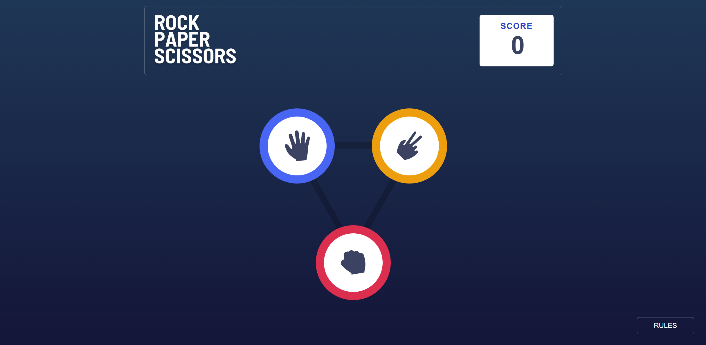
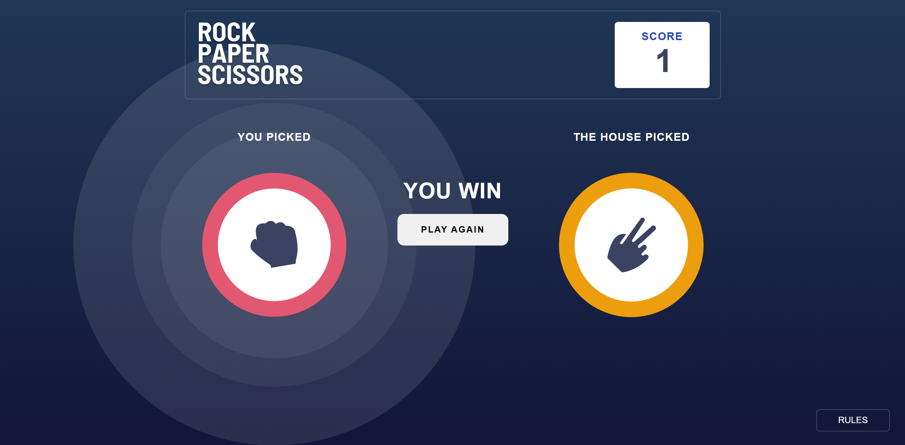
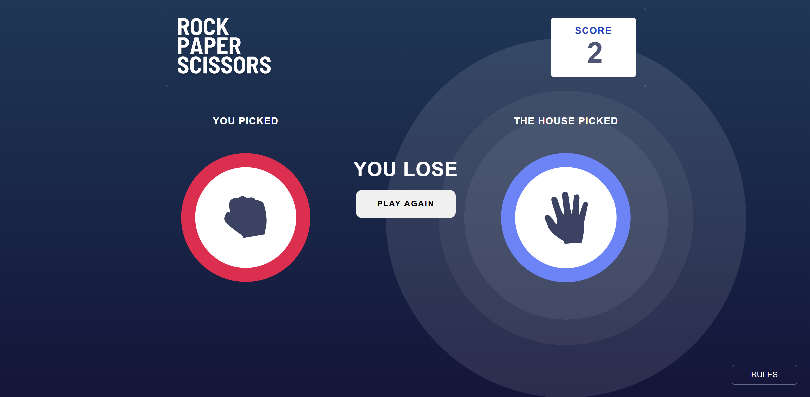

# Frontend Mentor - Rock, Paper, Scissors solution

This is a solution to the [Rock, Paper, Scissors challenge on Frontend Mentor](https://www.frontendmentor.io/challenges/rock-paper-scissors-game-pTgwgvgH). Frontend Mentor challenges help you improve your coding skills by building realistic projects. 

## Table of contents

- [Overview](#overview)
  - [The challenge](#the-challenge)
  - [Screenshot](#screenshot)
  - [Links](#links)
- [My process](#my-process)
  - [Built with](#built-with)
  - [What I learned](#what-i-learned)
  - [Continued development](#continued-development)
  - [Useful resources](#useful-resources)
- [Author](#author)
- [Acknowledgments](#acknowledgments)


## Overview
A Rock, Paper, Scissors game that allows user to pick an option among them and then the computer randomly pick among them who ever wins get an animation, also if the user win a point is added if they lose it deducted from the previous value and the score remain intact even after page refresh

### The challenge

Users should be able to:

- View the optimal layout for the game depending on their device's screen size
- Play Rock, Paper, Scissors against the computer
- Maintain the state of the score after refreshing the browser _(optional)_
- **Bonus**: Play Rock, Paper, Scissors, Lizard, Spock against the computer _(optional)_

### Screenshot
PLAY

WIN

LOSE



### Links

- Solution URL: [Add solution URL here](https://your-solution-url.com)
- Live Site URL: [Add live site URL here](https://your-live-site-url.com)

## My process

### Built with

- Reactjs
- CSS custom properties
- Flexbox
- CSS Grid
- Desktop-first workflow
- [React](https://reactjs.org/) - JS library

### What I learned

At first it may seem tough but when you understand the underlining logic you tend to get the hang of it.

I was trying the get the winner and loser normally a conditional statement does the work but since I was trying to update a state base on the condition inside a component I get an infinite loop error from React after a few try and error I had to use another react hook ***useEffect*** so the  update is happening only when a certain state update

To see how you can add code snippets, see below:

```js
const [rockPaperScissor, setRockPaperScissor] = useState('');
```
```js
useEffect(()=> {
    // TIED
    if (rockPaperScissor === getValue) {
      // console.log('TIED');
      setLoserAnimation(false)
      setWinnerAnimation(false)
      setWinOrLose('TIED');
      setCount((preValue) => preValue += 0)
    }
    
    // Win
    if (rockPaperScissor === 'paper' && getValue === 'rock') {
      console.log('YOU WIN');
      setWinnerAnimation(true)
      setCount((preValue) => preValue + 1)
      return setWinOrLose('YOU WIN');
    } 
    /* and more... */
    
    // lose
    if (rockPaperScissor === 'rock' && getValue === 'paper') {
      console.log('YOU LOSE');
      setLoserAnimation(true)
      setCount((preValue) => preValue - 1)
      setWinOrLose('YOU LOSE')
    }
    /* and more... */
  }, [rockPaperScissor])
```


### Continued development

React Router and More React usefulness


### Useful resources

- [React](https://react.dev) - Since I used react I figure the doc could be helpful.

## Author

- Website - [maduanusi](https://maduanusi.vercel.app/)
- Frontend Mentor - [@therealmaduanusi](https://www.frontendmentor.io/profile/therealmaduanusi)
- Twitter - [@madu_anusi](https://www.twitter.com/madu_anusi)


## Acknowledgments

FMC for creating such challenge and me for taking it on

